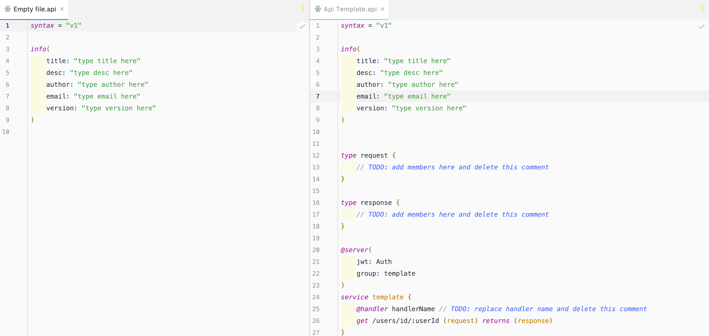

# Go-Zero Plugin

[](https://github.com/tal-tech/go-zero)
[](https://github.com/zeromicro/goctl-intellij/blob/main/LICENSE)

# 介绍
一款支持go-zero api语言结构语法高亮、检测以及api、rpc、model快捷生成的插件工具。


# idea版本要求

不低于193.0(2019.3)

# 版本特性

* api语法高亮
* api语法、语义检测
* struct、route、handler重复定义检测
* type跳转到类型声明位置
* 上下文菜单中支持api、rpc、mode相关menu选项
* 代码格式化(option+command+L)
* 代码提示

# 安装方式

## 方式一
在github的release中找到最新的zip包，下载本地安装即可。（无需解压）

## 方式二
在plugin商店中，搜索`Goctl`安装即可（目前商店中已通过的版本比较低。）


# 预览


# 新建 Api file

在工程区域目标文件夹`右键->New-> New Api File ->Empty File/Api Template`,如图：



# 新建 Proto File
在工程区目标文件夹`右键->New-> New Proto File -> Empty File/Proto Template`,如图：


# 快速生成api/rpc服务
在目标文件夹`右键->New->Go Zero -> Api Greet Service/Rpc Greet Service`


# Api/Rpc/Model Code生成

## 方法一(工程区域)

对应文件（api、proto、sql）`右键->New->Go Zero-> Api/Rpc/Model Code`,如图：


## 方法二（编辑区域）
对应文件（api、proto、sql）`右键-> Generate-> Api/Rpc/Model Code`


# 错误提示


# api语法说明

## 关键字
info、map、struct、interface、type、@server、@doc、service、returns、title、desc、author、email、version、group、jwt、summary、handler、get、head、post、put、patch、delete、connect、options、trace、bool、uint8、uint16、uint32、uint64、int8、int16、int32、int64、float32、float64、complex64、complex128、string、int、uint、uintptr、byte、rune。

## api文件

### 语法顺序
```
{import statement}?

{info block}?

{type block}?

{service block}?
```
### import statement

##### 是否必须：`NO`

##### 语法示例

```golang
import "user.api"
import "class.api"
```

#### info block

##### 是否必须：`NO`

##### 语法示例
```
info (
    // ${key}: ${value}
    title: "api grammar"
    desc: "how to code api"
    author: "anqiansong"
    email: "anqiansong@xiaoheiban.cn"
)
```
##### 语法说明：
key：`title`|`desc`|`author`|`email`|`version`

value：由`""`包围的非换页换行字符


### type block

##### 是否必须： `YES`

##### 语法示例：
```golang
type Alias = int
type Alias2 int
type User struct {
    Name string
}
type (
    Person struct{}
    Student struct {
        Gender int `json:"gender"`
        Description interface{} `json:"description"`
    }
    Request struct{}
    Response struct{}
)
```
##### 语法说明

和go语法一致，但map的key不支持非基本类型（string、boolean、number）及基本类型的别名

### service block

##### 是否必须： `YES`

##### 语法示例：

```golang
@server(
    jwt: "Auth" // ${jwtValue}jwt鉴权声明
    group: "User" // user服务生成代码后handler、logic按照此值归类
)
service ${serviceName} {
    @doc(
        summary: "路由说明" // ${summaryValue} 路由说明
    )
    // @server(
    //     @handler: login 
    // )
    @handler login
    // 路由
    post /user/login (Request) returns (Response);
    // 可定义多个路由
    ....
}
```
##### 语法说明
* ${serviceName}: 服务名称，由英文字母开头，并由字母、数字、下划线(_)、横杠(-)组成   
* jwt: jwt鉴权声明，代码该服务需要jwt鉴权  
* ${jwtValue}: jwt鉴权参数值  
* @doc(...): 路由说明  
* summary: 路由说明key  
* ${summaryValue}: 路由说明内容，由`""`包裹的字符串  
* @server: 内由kv结构组成，支持的key有 `jwt`(service外)、`folder`(service外)、`handler`(service内)
* ${handlerValue}: handler中go文件名称。必须为字母开头，并由字母、数字、下划线(_)组成，不能以`"`包裹
* 路由： 由`小写的请求方法名+路由path (请求体) returns (响应体);`格式组成
* 请求体、响应体:均为可选参必须为已定义的struct，仅支持普通struct，不支持指针，数组，map等其他类型，如需要以上结构请用struct包裹

# Live Template
Live Template可以加快我们对api文件的编写，比如我们在go文件中输入`main`关键字根据tip回车后会插入一段模板代码
```golang
func main(){

}
```
或者说看到下图你会更加熟悉，曾几何时你还在这里定义过template


下面就进入今天api语法中的模板使用说明吧，我们先来看看service模板的效果


首先上一张图了解一下api文件中几个模板生效区域（psiTree元素区域）


#### 预设模板及生效区域
|  模板关键字   | psiTree生效区域 |描述 
|  ----  | ----  | ----  | 
| @doc  | ApiService |doc注释模板|
| doc  | ApiService |doc注释模板|
| struct  | Struct |struct声明模板|
| info  | ApiFile |info block模板|
| type  | ApiFile |type group模板|
| handler  | ApiService |handler文件名模板|
| get  | ApiService |get方法路由模板|
| head  | ApiService |head方法路由模板|
| post  | ApiService |post方法路由模板|
| put  | ApiService |put方法路由模板|
| delete  | ApiService |delete方法路由模板|
| connect  | ApiService |connect方法路由模板|
| options  | ApiService |options方法路由模板|
| trace  | ApiService |trace方法路由模板|
| service  | ApiFile |service服务block模板|
| json  | Tag|Tag literal |tag模板|
| xml  | Tag|Tag literal |tag模板|
| path  | Tag|Tag literal |tag模板|
| form  | Tag|Tag literal |tag模板|

关于每个模板对应内容可在`Goland(mac Os)->Preference->Editor->Live Templates-> Api|Api Tags`中查看详细模板内容，如json tag模板内容为
```golang
json:"$FIELD_NAME$"
```


> 注意： 关键字区分大小写


# 注意事项
目前api文件中，仅type block支持单行注释，但目前idea并没有对其他block单行注释进行报错，这个是需要后期完善的功能。后续陆续将api文件中都支持单行注释。

# 待完善功能
* 语法、语义检测优化
* 完善高亮优化
* 完善智能提示
* Find Usages
